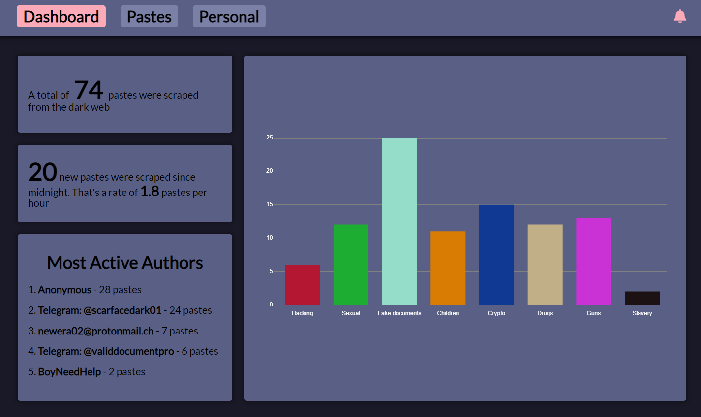
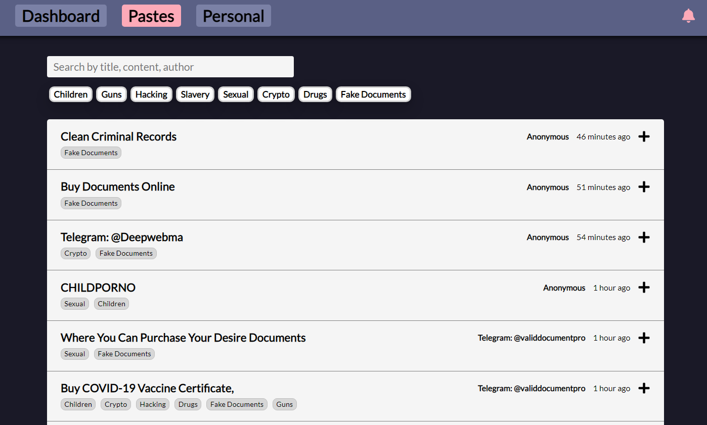
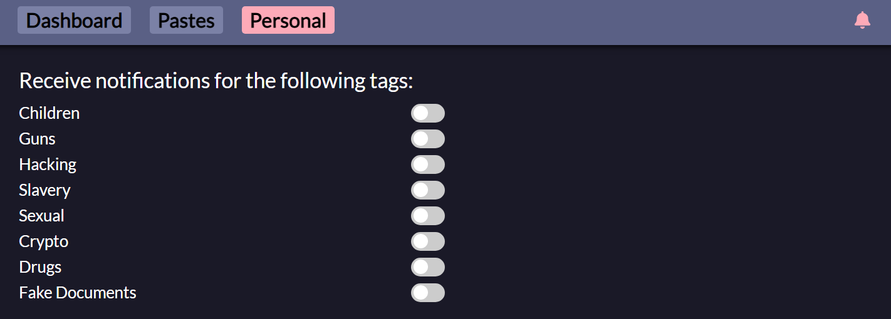
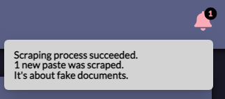

# Intsights Darkweb Scraper

This project was collaborated with Rapid7, as part of the Cyber4s program by Scale-Up Velocity.

The goal of the project is to scrape data from a pastes site (like Pastebin) in the dark web.  
The data should be analyzed and saved in a database, and then be presented in a dashboard.

The code is split to a front end application and 2 main services:

- **Frontend**: built with **React** and **Typescript**.
- **Backend**: built with **Nodejs**, **Express**, **Typescript** and **MongoDB**.
- **Scraper**: built with **Python** and **MongoDB**.

The paste site is scraped from Tor browser.  
The API server and the python scraper act as microservices and communicate via RabbitMQ.  
The entire application is dockerized using docker-compose.

---

## Live Application

Deployed on an AWS EC2 instance.

**Beware - The pastes in the website are real, some content may be inappropriate.**  
<a href="http://darkweb-scraper.tk">darkweb-scraper.tk</a>  
(<a href="http://ec2-157-175-95-185.me-south-1.compute.amazonaws.com/">Alternative Link</a>)

---

## Run locally

In the root folder run:

```
docker-compose up
```

Note: it might take some time for all the container to build.

When all the containers are running, go to <a href="http://localhost:3000">localhost:3000</a>.

You will then have to wait for the first scrape to complete before any data will be presented in the dashboard.

---

## Features

### Dashboard Page, containing general information about all the scraped pastes.



### Pastes Page, allowing browsing of all scraped pastes, or filter pastes by search terms or tags.



### Personal Page, allowing the user to select tags for which he will receive notifications.



### When a scraping cycle finishes, the user receives a notification, containing the result of the scrape and relevant information based on his personal configuration.



### When a user enters the application after being offline, he gets a rundown of the application activity for the time he was logged off, including relevant information based on his personal configuration.


